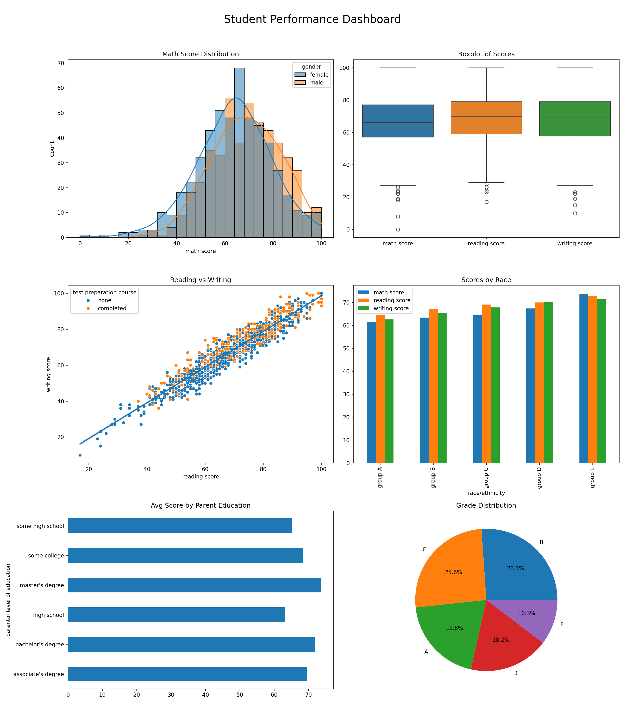

# Student Performance Analysis (Week 1 Internship)

**Name**
Ijaz Ahmad 

**Project Title**
Student Performance Analysis using Python

**Dataset**
StudentsPerformance.csv

**Key Findings**
- Strong positive correlation exists between reading and writing scores.
- Students who completed test preparation generally performed better.
- Parental education level shows influence on average student scores.

**Tools & Libraries Used**
- Python
- Pandas
- NumPy
- Matplotlib
- Seaborn

**Best Visualization**

**Repository Structure**
- notebooks/ → Jupyter notebook
- output/ → charts and results
- reports/ → PDF report
- src/ → Python scripts

